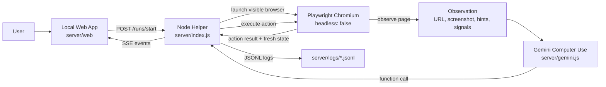

# Gemini Computer Use (Playwright Runtime)

Local-first Gemini Computer Use runner built around:
- a local web app for entering `startUrl`, `prompt`, and an optional Gemini API key
- a headed Playwright browser so every browser action is visible
- a Node helper loop that captures state, calls Gemini Computer Use, executes actions, and streams logs back to the UI

## Current Architecture

The active runtime is Playwright-first

Core components:
- `server/web/`
  - local UI for prompt entry, start URL, stop control, and live run log
  - stores user input fields in local storage
- `server/index.js`
  - HTTP server and SSE event stream
  - run/session lifecycle management
  - same-site policy enforcement and run logging
- `server/gemini.js`
  - Gemini Computer Use request builder
  - planner/persistence policy
  - Computer Use conversation loop
- `server/playwright-runtime.js`
  - headed Chromium runtime
  - screenshot capture
  - browser action execution
- `shared/protocol.js`
  - shared action/result/status constants and URL safety helpers

## Architecture Diagram



## Computer Use Loop

The helper keeps the control loop, but the browser is the real execution environment.

Current flow:
1. The user enters a prompt and start URL in the local web app.
2. The server launches a visible Playwright Chromium session at the requested URL.
3. The runtime captures a fresh observation:
   - current URL
   - page title
   - viewport
   - screenshot
   - compact page summary
   - interactive hints
   - UI signals
4. The helper sends that state to Gemini Computer Use.
5. Gemini returns one action at a time, such as `click_at`, `type_text_at`, `scroll_document`, `go_back`, or `navigate`.
6. The helper validates policy, executes the action in Playwright, captures a fresh observation, and sends a matching function response back into the Computer Use loop.
7. Progress, action results, and terminal state are streamed to the UI over SSE and written to JSONL logs.

## On-Spec Behavior

The current implementation is intentionally trying to stay as close as possible to Gemini Computer Use expectations:
- Browser size is fixed to the recommended `1440x900`.
- The browser is visible at all times.
- Computer Use coordinates are normalized to the `0-999` grid.
- The helper uses a minimal conversation chain:
  - initial `user` state
  - latest `model` function call
  - matching `user` function response
- `require_confirmation` is auto-continued locally instead of stopping the run.
- Same-site scope is enforced for all navigation and link-following.

## Runtime API

- Start UI: `GET /`
- Start run: `POST /runs/start`
  - body: `{ prompt, startUrl, geminiApiKey? }`
- Stop run: `POST /runs/:id/stop`
- Event stream: `GET /runs/:id/events`

SSE event types:
- `status`
- `thought`
- `action`
- `action_result`
- `done`
- `error`

## Action Policy

Executed action types:
- `click_at`
- `type_text_at`
- `scroll_document`
- `wait_5_seconds`
- `go_back`
- `navigate`

Guardrails:
- start-domain only
- no cross-site navigation
- no password/card/sensitive field interaction
- no downloads or external browser actions
- no final payment/account-risk actions through the hard blocklist

## Logging

Each run writes a JSONL log file under `server/logs/` with an ascending numeric prefix:
- `0001-<runId>.jsonl`
- `0002-<runId>.jsonl`

Logs include:
- session start/end
- observations
- Gemini request/response summaries
- planner actions
- action results
- diagnostic summary

## Run Locally

1. Install dependencies:

```bash
npm install
```

2. Set Gemini API key:

```bash
export GEMINI_API_KEY=your_key_here
```

You can also paste the key directly into the web app `Gemini API Key` field for a single run.

3. Start the server:

```bash
npm start
```

4. Open:

```text
http://127.0.0.1:3210
```

Then enter `startUrl` and `prompt`, and click `Run`.

## Notes

- Gemini Computer Use is preview tooling, so model behavior and safety responses can still vary between runs.
- The current main failure modes are site overlays/popups and model action quality.

## Tests

```bash
npm test
```
